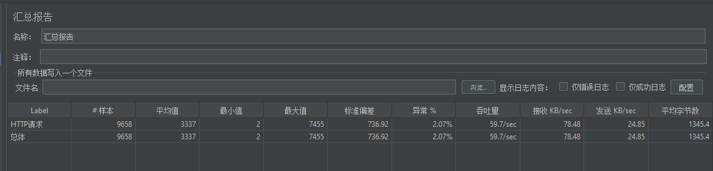
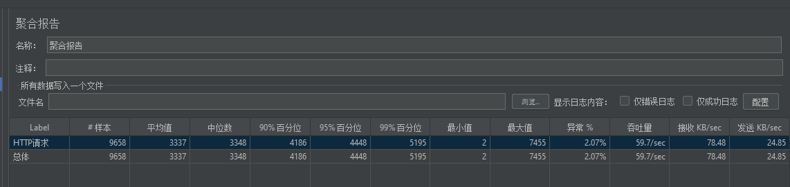
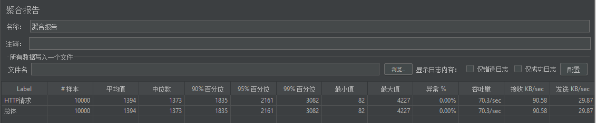
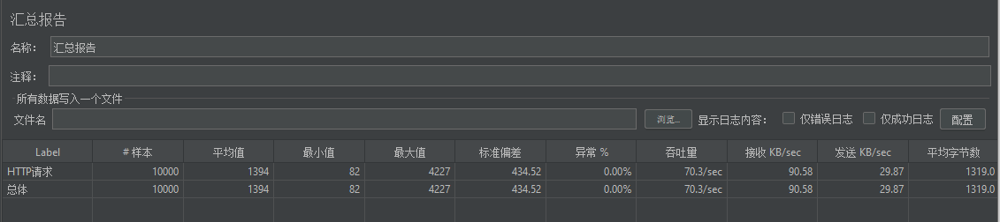

# 1：添加redis

- 没有添加redis






- 添加redis






**这个是10000个用户在1秒中的请求**

没有添加redis平均值是3337ms

有redis是1394ms


```java
customfilter

//redis中是否有permission
Boolean key = redisTemplate.hasKey(PERMISSION_LIST);
List<Permission> permissionList = null;

if (key) {
    //直接去redis中
    permissionList = (List<Permission>) redisTemplate.opsForValue().get(PERMISSION_LIST);
} else {
    //去数据库中获取所有的url
    permissionList = permissionService.getPermissionWidthRole();
    redisTemplate.opsForValue().set(PERMISSION_LIST, permissionList);
}
```


